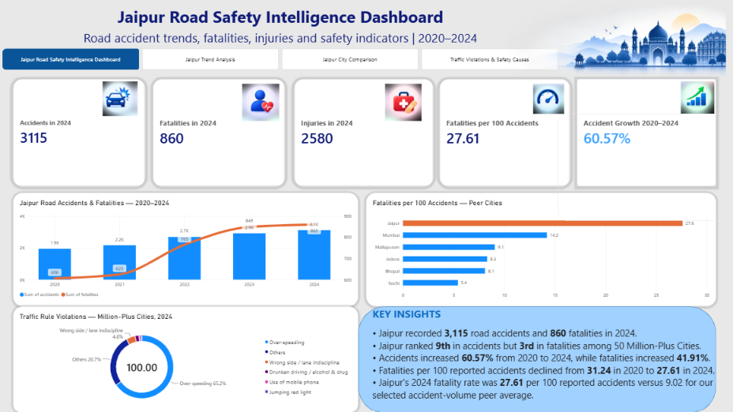
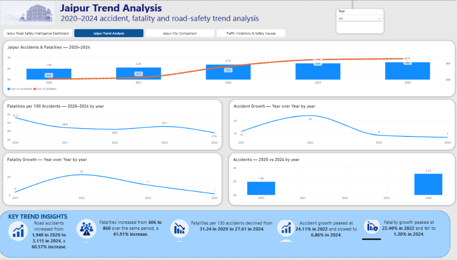
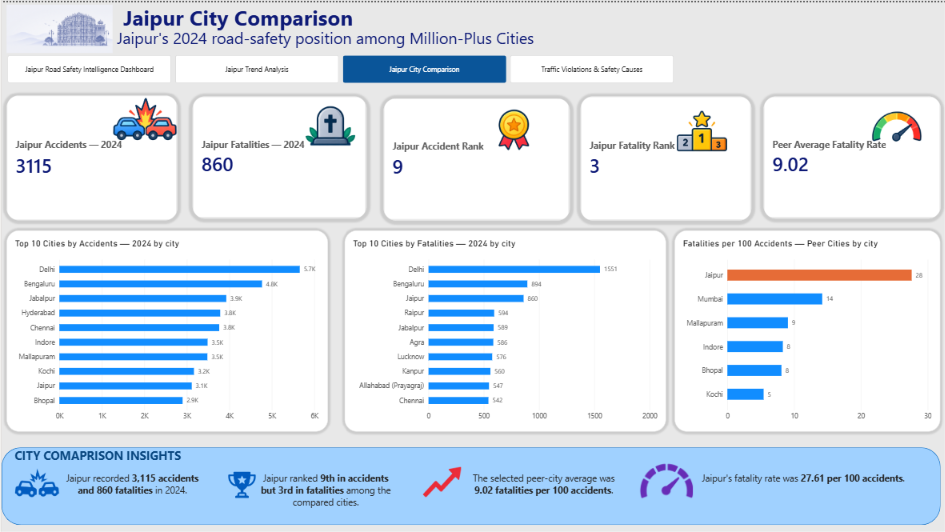
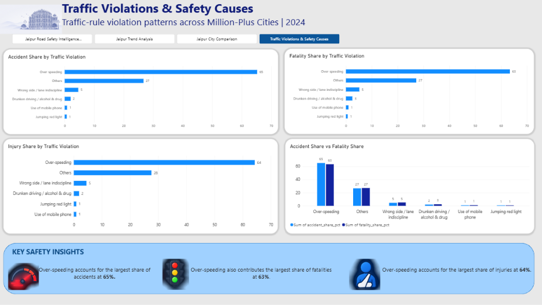

# Jaipur Road Safety Intelligence Dashboard

An interactive Power BI dashboard analyzing road accidents, fatalities, injuries, traffic violations, and city-level road safety trends across 2020–2024.

## Dashboard Preview

### Jaipur Road Safety Intelligence

### Jaipur Trend Analysis

### Jaipur City Comparison

### Traffic Violations & Safety Causes

## Project Overview

This project presents an interactive Power BI dashboard focused on road safety analysis in Jaipur and comparison with other Million-Plus cities.

The dashboard analyzes accident trends, fatalities, injuries, fatality rates, accident growth, city rankings, and traffic-rule violations over the 2020–2024 period.

## Objectives

- Analyze Jaipur's road accident trends from 2020–2024.
- Examine changes in fatalities and injuries.
- Track fatalities per 100 accidents.
- Compare Jaipur with other Million-Plus cities.
- Identify major traffic violations associated with accidents, fatalities, and injuries.
- Present the findings through an interactive Power BI dashboard.

## Tools & Technologies

- Microsoft Power BI
- Power Query
- DAX
- Data Modeling
- Data Visualization

## Dashboard Pages

### 1. Jaipur Road Safety Intelligence

Provides a high-level overview of Jaipur's road safety situation, including:

- 2024 accidents
- 2024 fatalities
- 2024 injuries
- Fatalities per 100 accidents
- Accident growth
- Accident and fatality trends
- Peer-city fatality comparison
- Traffic-rule violation distribution

### 2. Jaipur Trend Analysis

Analyzes Jaipur's road-safety trends from 2020–2024, including:

- Accident and fatality trends
- Fatalities per 100 accidents
- Year-over-year accident growth
- Year-over-year fatality growth
- 2020 vs 2024 accident comparison

### 3. Jaipur City Comparison

Compares Jaipur with other Million-Plus cities using:

- Accident rankings
- Fatality rankings
- Fatalities per 100 accidents
- Peer-city comparisons

### 4. Traffic Violations & Safety Causes

Analyzes traffic-rule violations across:

- Accident share
- Fatality share
- Injury share
- Accident vs fatality share

## Key Findings

- Road accidents increased from **1,940 in 2020 to 3,115 in 2024**, a **60.57% increase**.
- Fatalities increased from **606 in 2020 to 860 in 2024**, a **41.91% increase**.
- Fatalities per 100 accidents declined from **31.24 in 2020 to 27.61 in 2024**.
- Jaipur ranked **9th in accidents but 3rd in fatalities** among the compared cities.
- Over-speeding represented the largest share of reported accidents, fatalities, and injuries.

## Project File

The Power BI dashboard file is included in this repository:

`jaipur_road_safety_intelligence_powerbi.pbix`

## Future Improvements

- Add more recent years as data becomes available.
- Add geographic/map-based analysis.
- Include more detailed state and city comparisons.
- Explore predictive road-safety analysis.
- Add additional road and traffic-related indicators.
